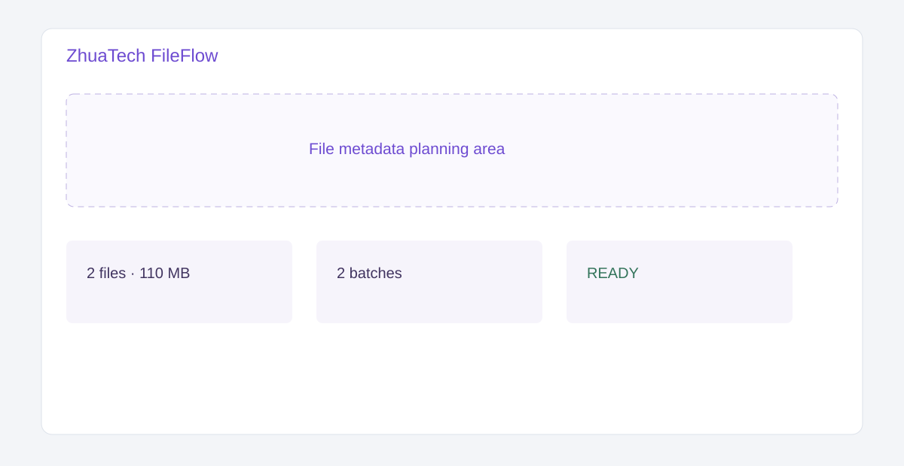

# ZhuaTech FileFlow · 知华文件批处理规划工具

上海如静知华信息科技有限公司社区源码工具，用于批量文件元数据检查、格式兼容判断、容量分批与处理时间估算。[官网](https://www.zhuatech.cn/)



接口 `POST /api/fileflow/plan` 接收文件名称、类型和大小，仅处理元数据，不上传真实文件；支持 `ARCHIVE`、`RENAME`、`CONVERT_PDF` 三类任务，返回批次数、预计时长、不支持文件和 `READY/REVIEW/BLOCK`。项目包含 Java 21、响应式 H5 与 MySQL。

本机演示可直接执行：

```bash
docker compose up -d --build --wait
```

打开 `http://localhost:8088`。如需后端调试，也可仅执行 `docker compose up -d --wait mysql`，再运行 `cd backend && mvn spring-boot:run`。

打开 `frontend/index.html`。MySQL 仅监听 `127.0.0.1:3310`；仓库内默认口令只用于本机演示。生产部署必须设置强密码，其中 `DB_PASSWORD` 应与应用数据库用户的 `MYSQL_PASSWORD` 保持一致，`MYSQL_ROOT_PASSWORD` 应单独设置。

本项目仅限个人学习、研究和非商业交流，**不得商用**。企业内部使用、生产部署、SaaS、客户交付、收费处理和品牌替换须取得上海如静知华信息科技有限公司书面授权，详见 [LICENSE](LICENSE)。

| 微信一 | 微信二 |
|---|---|
|  |  |

SEO：文件批处理工具、文件转换规划、批量重命名、Java 文件工具、知华科技。
